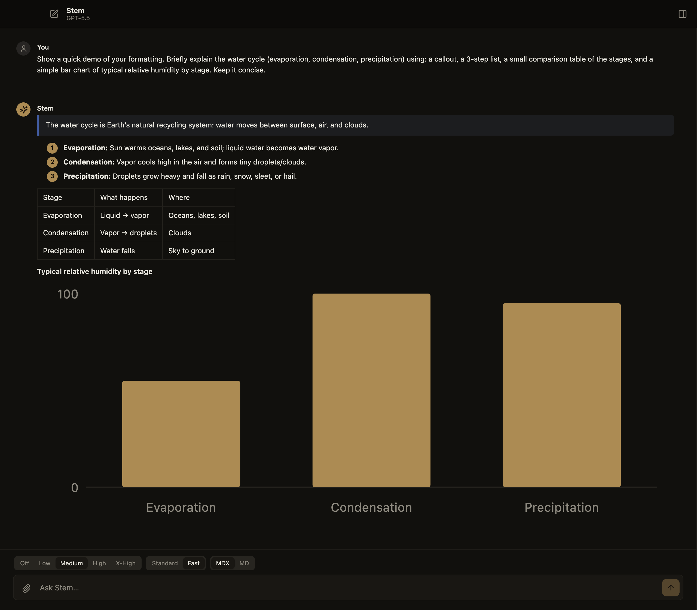
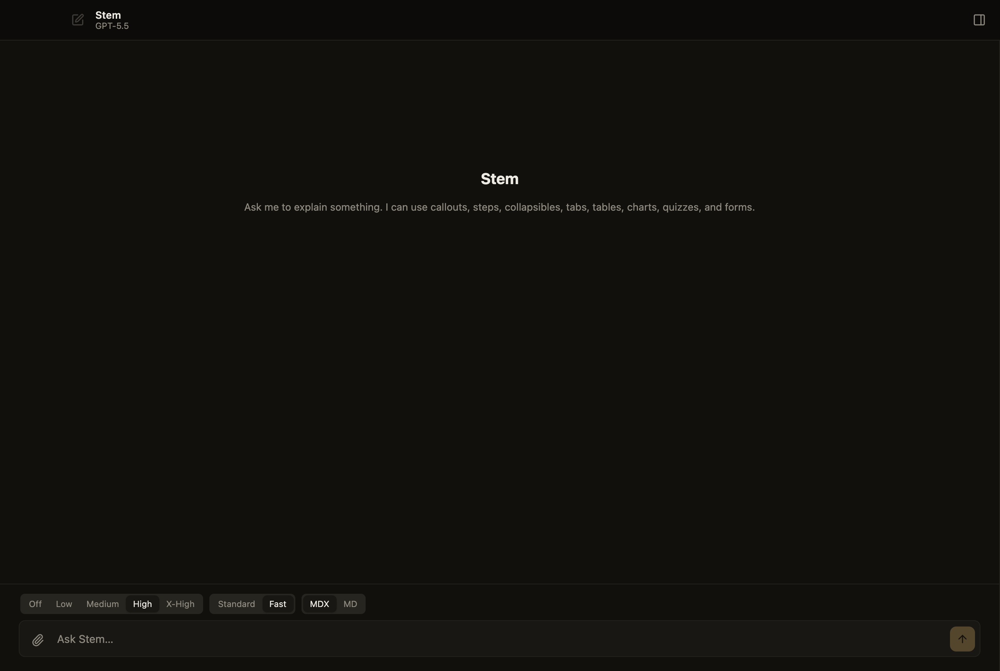

# Stem

An isolated, pi-backed macOS personal assistant with rich MDX output, app-scoped skills, MCP, and Stem Recall memory.

Stem is an Electron desktop app (Electron + React + TypeScript) that runs a conversational assistant backed by [pi](https://pi.dev). It renders assistant responses as MDX, organizes work into Spaces, supports self-improving skills and MCP servers, and keeps a long-lived memory via **Stem Recall**.



## Features

- **MDX output** — assistant responses render as rich, interactive MDX rather than plain text.
- **Spaces** — chats are organized into Spaces, with root chats grouped by date in the sidebar.
- **Skills** — app-scoped, self-improving skills that the assistant can manage and refine over time.
- **MCP** — connect Model Context Protocol servers to extend the assistant's tools.
- **Stem Recall** — long-term memory combining FTS5 episodic recall with LLM-distilled facts.
- **Connected folders** — read external folders in place (read-only), without copying them into the app.
- **Native web search** — provider-aware web search.

## Screenshots

Assistant responses render as rich MDX — callouts, steps, tables, and charts (above). The empty state, ready for a question:



## Getting started

Requires Node.js and macOS.

```bash
npm install
npm run dev      # launch the app in development
```

## Scripts

| Command | Description |
| --- | --- |
| `npm run dev` | Run the app in development (electron-vite) |
| `npm run build` | Type-check and build |
| `npm run typecheck` | Type-check only |
| `npm run lint` | Lint with ESLint |
| `npm test` | Run unit tests (Vitest) |
| `npm run test:e2e` | Run end-to-end tests (Playwright) |

## Tech stack

Electron, React 19, TypeScript, Vite (electron-vite), Vitest, Playwright, and unified/remark for MDX.
