

  

<h1 align="center">Stem</h1>

  A desktop AI assistant that remembers you, reads your folders and runs jobs on a schedule. 
  It runs on the ChatGPT, Claude or Grok subscription you already pay for, any API key, or a local model.

  <a href="https://github.com/join3r/stem/releases/latest"><b>Download</b></a>
  · macOS (Apple Silicon) · Linux (AppImage, deb) ·
  <a href="docs/README.md">User guide</a>

<picture>
  <source media="(prefers-color-scheme: dark)" srcset="docs/screenshots/hero-dark.png">
  
</picture>

## Answers you can scan

Replies render as MDX. You get charts, stat tiles, sortable tables, side-by-side comparisons, diagrams, step lists, quizzes and forms when the question calls for one, and a plain paragraph when it doesn't. Any chat can switch to Markdown.

<table>
  <tr>
    <td width="33%">
      <picture>
        <source media="(prefers-color-scheme: dark)" srcset="docs/screenshots/answer-diagram-dark.png">
        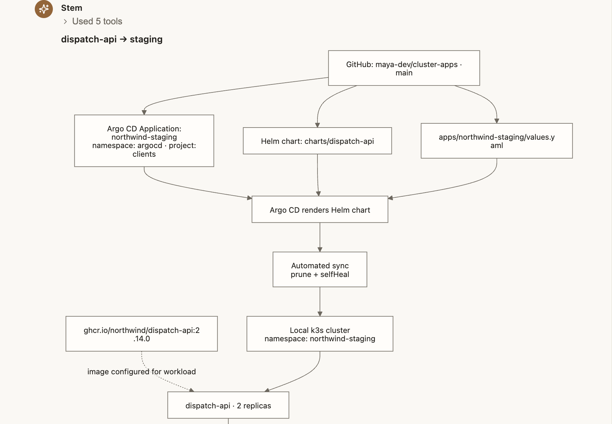
      </picture>
    </td>
    <td width="33%">
      <picture>
        <source media="(prefers-color-scheme: dark)" srcset="docs/screenshots/answer-compare-dark.png">
        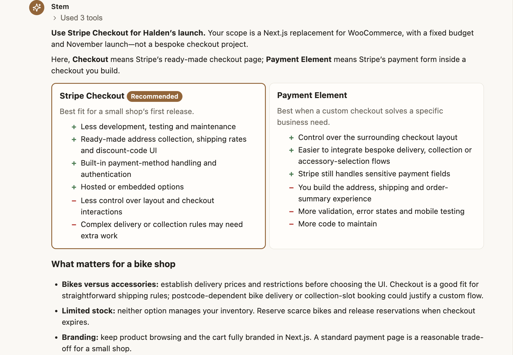
      </picture>
    </td>
    <td width="33%">
      <picture>
        <source media="(prefers-color-scheme: dark)" srcset="docs/screenshots/answer-picture-dark.png">
        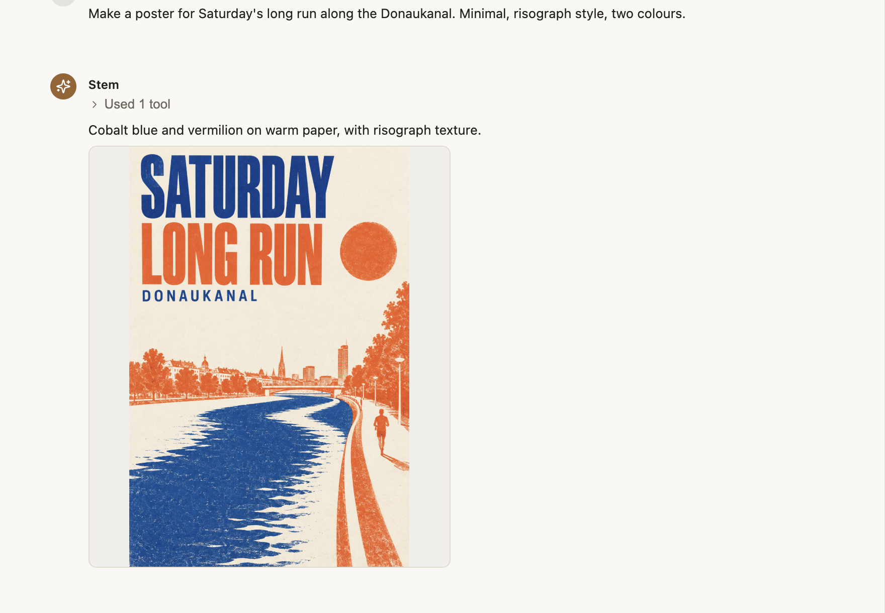
      </picture>
    </td>
  </tr>
  <tr>
    <td align="center">Diagrams</td>
    <td align="center">Comparisons</td>
    <td align="center">Pictures, on your ChatGPT plan</td>
  </tr>
</table>

## Memory you can audit

Stem pulls durable facts out of your chats and folders. Each message gets only the facts that matter for it, ranked on your machine by bundled models (a Qwen3 embedder and Stem's own GTE reranker). Every fact shows where it came from and whether the last answer used it. Pin, confirm or forget any of them, settle contradictions, or switch memory off.

<picture>
  <source media="(prefers-color-scheme: dark)" srcset="docs/screenshots/memory-dark.png">
  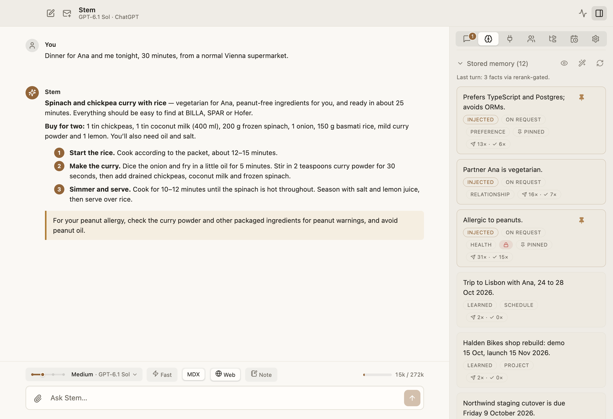
</picture>

## Your folders, read in place

Connect an Obsidian vault, a repo or a folder of invoices. Stem reads the files where they live and indexes them locally. Folders are read-only until you allow writes, and you decide per folder whether anything in it may reach memory.

<picture>
  <source media="(prefers-color-scheme: dark)" srcset="docs/screenshots/folders-dark.png">
  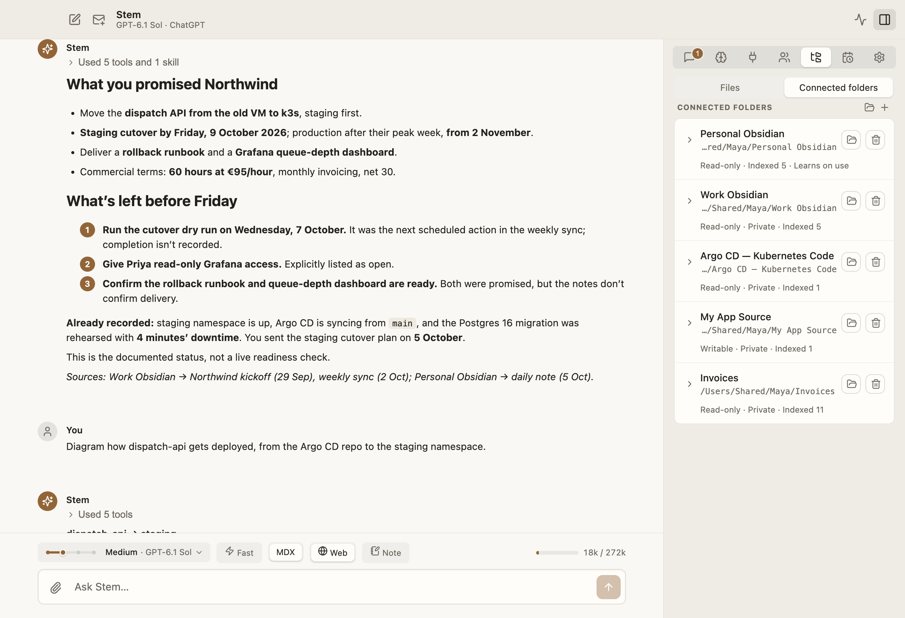
</picture>

## Personas and mail

A persona is a saved setup: instructions, model, tools, MCP servers, memory, a coding agent or a computer it may drive. You mail it like a colleague and the reply lands in the Inbox. The Orchestrator splits a big job across helper personas it creates and sends you one answer. Scheduled tasks report here too, and only when they found something.

<picture>
  <source media="(prefers-color-scheme: dark)" srcset="docs/screenshots/mail-dark.png">
  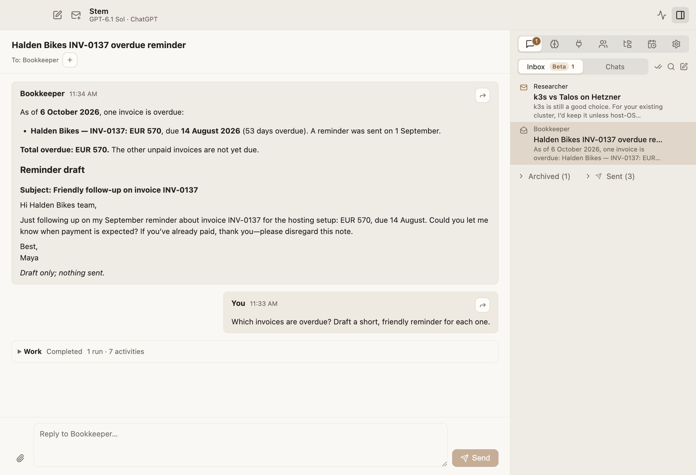
</picture>

## Quick Chat

A global shortcut opens Quick Chat over whatever app you're in. Ask, hit Enter, and it gets out of the way. A pill in the corner tells you when the answer is ready.

  <picture>
    <source media="(prefers-color-scheme: dark)" srcset="docs/screenshots/quick-chat-dark.png">
    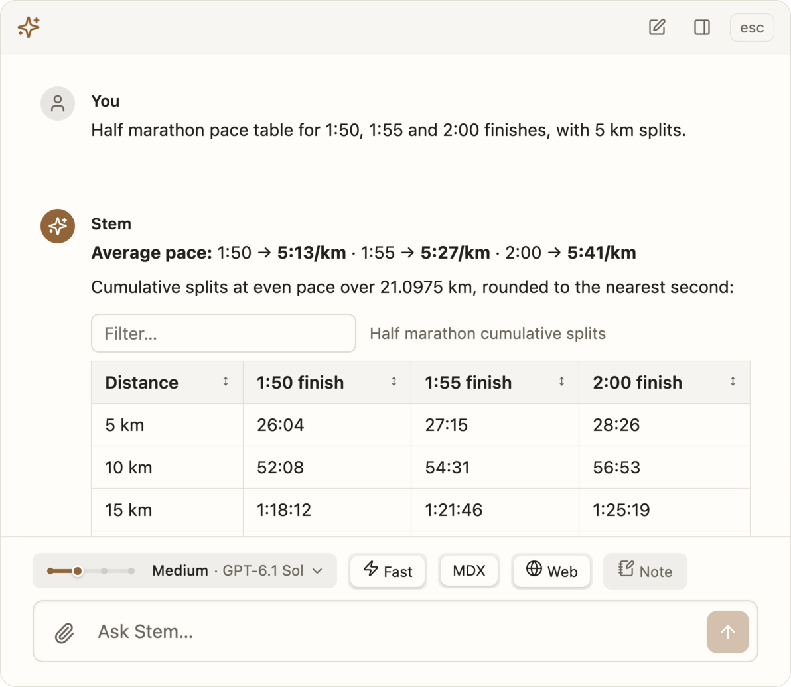
  </picture>
   
  <picture>
    <source media="(prefers-color-scheme: dark)" srcset="docs/screenshots/status-hud-dark.png">
    
  </picture>

## Also in the box

- **Coding agents.** A persona hands work to Claude Code or any other ACP agent, on the server or on one of your computers. The agent's permission requests arrive as cards in the chat.
- **Computer control.** A persona pinned to your Mac can work in its apps, including windows on another Space or behind other windows. macOS 14 or newer.
- **Browser control.** The Stem extension for Arc, Chrome, Dia and Brave lets Stem use your own signed-in browser in background tabs.
- **Scheduled tasks.** Ask for "every weekday at 8, check…" and you get a cron job. Each run starts in a fresh thread.
- **Shell commands.** A judge model checks each command against what you asked for. Only the flagged ones wait for you.
- **MCP servers and skills.** Add MCP servers by command or URL, OAuth included. Stem writes skills from work that went well and rewrites the ones that failed.
- **Pinboard.** Pin a message, a highlighted phrase or your own note to the top of a chat. Stem keeps the board in context for the rest of that chat.
- **Private chats.** A private chat doesn't read your memory and teaches it nothing.
- **Themes.** Light, dark, bundled themes, or a JSON file of your own that can also set fonts and spacing.

<table>
  <tr>
    <td width="33%"><picture><source media="(prefers-color-scheme: dark)" srcset="docs/screenshots/panel-models-dark.png">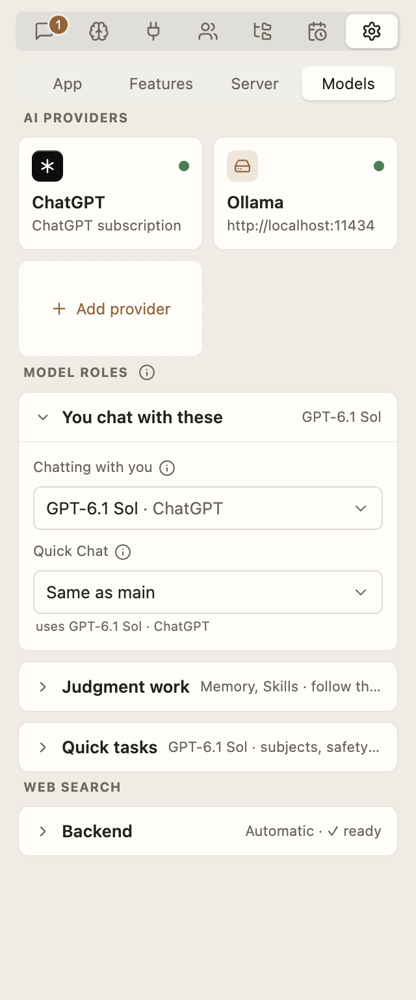</picture></td>
    <td width="33%"><picture><source media="(prefers-color-scheme: dark)" srcset="docs/screenshots/panel-features-dark.png">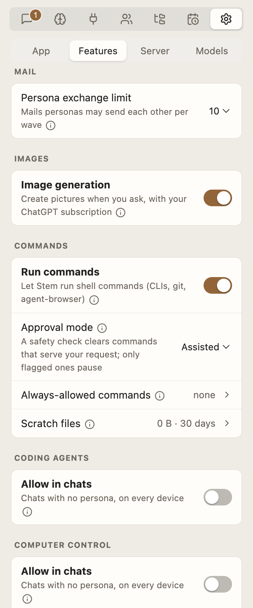</picture></td>
    <td width="33%"><picture><source media="(prefers-color-scheme: dark)" srcset="docs/screenshots/panel-personas-dark.png">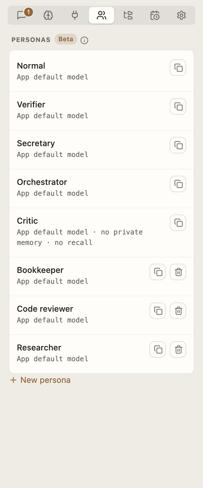</picture></td>
  </tr>
  <tr>
    <td align="center">Models</td>
    <td align="center">Features</td>
    <td align="center">Personas</td>
  </tr>
  <tr>
    <td width="33%"><picture><source media="(prefers-color-scheme: dark)" srcset="docs/screenshots/panel-tasks-dark.png"></picture></td>
    <td width="33%"><picture><source media="(prefers-color-scheme: dark)" srcset="docs/screenshots/panel-mcp-dark.png">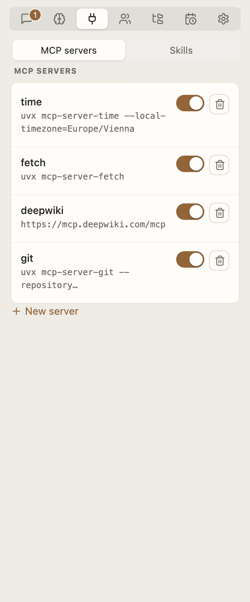</picture></td>
    <td width="33%"><picture><source media="(prefers-color-scheme: dark)" srcset="docs/screenshots/panel-skills-dark.png">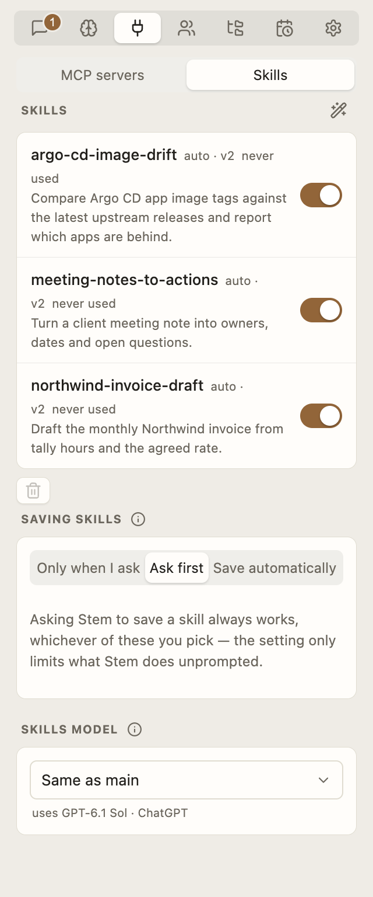</picture></td>
  </tr>
  <tr>
    <td align="center">Scheduled tasks</td>
    <td align="center">MCP servers</td>
    <td align="center">Skills</td>
  </tr>
</table>

## Models

| Provider | How you connect |
| --- | --- |
| ChatGPT, Claude, Grok | Sign in with your subscription |
| OpenAI, Anthropic, OpenRouter, xAI | API key |
| Ollama, LM Studio | Local server, no key |
| Anything OpenAI- or Anthropic-compatible | Custom endpoint |

Switch models per chat, mid-conversation. Web search works with every model and cites its sources; a ChatGPT or Grok sign-in covers it without a separate search key.

## Run it on a server

By default Stem runs on your computer. Move it to a VPS with Docker and Caddy, or to a box on your Tailscale network, and every Mac, Linux machine and the iPhone app (beta) becomes a client of that one Stem. They share chats, memory and tasks, and scheduled runs fire while the laptop is closed. An MCP server or folder that only makes sense on your laptop stays pinned to it.

[Running on a server](docs/running-on-a-server.md) · [Running on a LAN or Tailscale](docs/running-on-tailscale.md)

## Install

Grab the latest build from [Releases](https://github.com/join3r/stem/releases/latest):

- **macOS.** `.dmg` for Apple Silicon, signed and notarized.
- **Linux.** `.AppImage` for any distro, or `.deb` for Debian and Ubuntu (also puts `stem` on your PATH). Both for x64 and arm64.

First launch walks you through signing in to a provider.

Linux notes

- **Quick Chat on Wayland.** Electron's global shortcuts don't fire in default GNOME and KDE sessions. Bind a system shortcut to `stem --quick-chat` (deb) or `/path/to/Stem.AppImage --quick-chat`; a second launch hands the toggle to the running app. On X11 the in-app shortcut works.
- **Tray.** The tray icon offers Summon Quick Chat, Open Stem and Quit. Stock GNOME hides tray icons without the [AppIndicator extension](https://extensions.gnome.org/extension/615/appindicator-support/); running `stem` again reopens the main window.
- **Closing the window** leaves Stem running in the background. Quit from the tray.
- **Secrets** are encrypted with the system keyring (`libsecret` or kwallet). Without one, Stem falls back to files readable only by your user (mode 0600).

## Build from source

Node.js 24 or newer, then `npm install && npm run dev`. Scripts, Windows and the rest are in [docs/development.md](docs/development.md).
