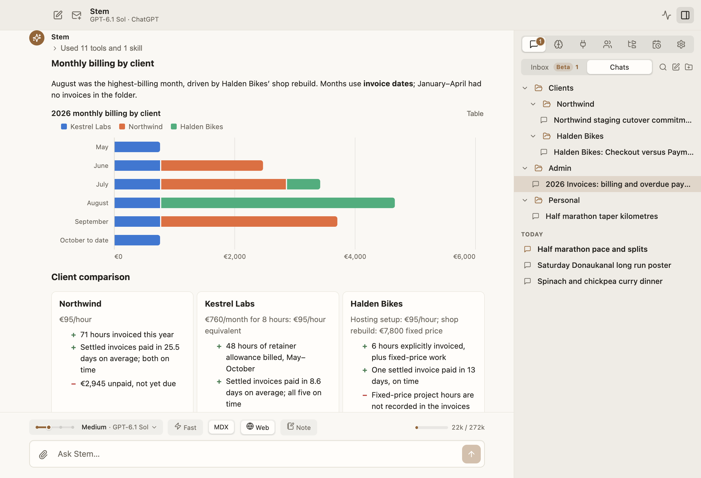

# Chats

← [Stem guide](../README.md)

Maya creates a **Clients** folder, adds a **Northwind** subfolder, and starts a chat
there:

> Review this launch plan. List the three riskiest assumptions.

<picture>
  <source media="(prefers-color-scheme: dark)" srcset="../screenshots/hero-dark.png">
  
</picture>

## Ask

- Drop a file on **This chat** for one message. Drop it on **Files** to copy it into
  Stem for reuse across chats.
- Choose model, effort, and speed.
- Each chat is **MDX** or plain **Markdown**. In an MDX chat, answers can include
  charts, tables, side-by-side comparisons, KPI tiles, diagrams, step lists, tabs,
  quizzes, forms, and suggested follow-ups you can click. They render as the answer
  streams in. A chart's **Table** button shows its numbers. The toggle in the
  composer sets the format for new chats; in an open chat it switches that chat.
  Markdown chats keep answers plain and send the model less text.
- More effort can use more quota. **Fast** appears only for supported models and
  increases usage.
- Watch tool activity while Stem works.
- **Web** turns web search on or off for the next message. It stays where you leave
  it, and is the same switch as **Settings → App → Web search**. Quick Chat keeps
  its own.
- Web answers include cited sources: the sites' icons show under the answer;
  open them for a card per source.
- The context meter shows how full the conversation is.
- Ask for a picture and Stem draws it with your ChatGPT subscription (see
  [Settings → Image generation](settings.md#image-generation)). Click it to enlarge.
  Under each picture, or on right-click: **Save to Downloads** (straight into your
  Downloads folder, no dialog) and **Copy**. On the phone, tap the picture and use
  **Share**, which has Save Image. To change a picture, just say what to change;
  to edit a photo, attach it and say what to change.

## Organize and find work

- Use **+** on a folder to start a chat inside it.
- Drag chats and folders to move or nest them.
- Right-click a chat to rename, move, or delete it. Deletion is permanent. Tasks
  scheduled from the chat stay: they run on their own and report by mail.
- Right-click a folder to create a subfolder, rename, or delete it. Deleting a folder
  moves its chats and child folders to the parent.
- Use **Search**, `⌘F` on Mac, or `Ctrl+F` on Linux to search titles and message
  text across every chat.

Once a chat has sat untouched for a day, Stem files it into one of your folders if
one clearly fits, and otherwise leaves it where it is. It only uses folders you
made, looks at each chat once, and never moves a chat you placed yourself or a
private chat. To undo a move, drag the chat back; it then stays wherever you put
it. Turn this off in **Settings → App → File idle chats into folders**.

## Change a conversation

Hover over a message to reveal its actions:

- **Retry**: run that turn again.
- **Edit and run**: replace your message, then continue from there.
- **Fork**: copy the conversation up to that point into a new chat.
- **Delete from here**: remove that turn and everything after it. Requires a second
  click.

Each chat keeps its selected model and effort. Changing them in one chat does not
rewrite earlier answers.

<!-- TODO(screenshot): Message actions on a user message, including Fork and Delete from here. -->
