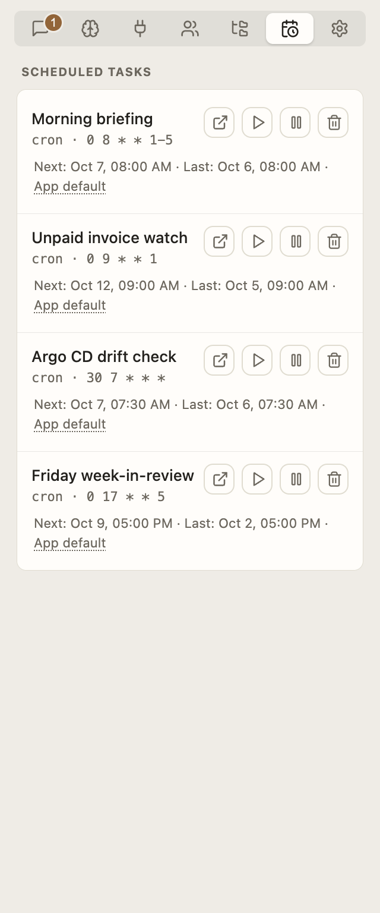

# Scheduled tasks

← [Stem guide](../README.md)

Maya creates tasks by asking in a chat:

> Every Monday, check whether all software installed on this Mac is supported by
> the next macOS version currently in beta. Alert me only about unsupported or
> unknown apps, with source links.

> Every Friday, find AI-generated sci-fi short films released that week on YouTube
> or discussed on Reddit. Show only well-liked films, with direct links and visible
> audience signals.

Every run starts fresh, in a thread of its own, and anything it has for Maya
arrives as mail in the Inbox.

  <picture>
    <source media="(prefers-color-scheme: dark)" srcset="../screenshots/panel-tasks-dark.png">
    
  </picture>

## What to expect

- Stem must be running. If Stem is closed or the computer sleeps, each overdue task
  runs once when Stem can run again.
- Times use the computer’s local time.
- Each run starts with an empty context: the task’s prompt, the persona it runs
  as (if any), and your memory. Nothing said in the chat that created the task
  carries over, so the prompt has to say everything the run needs. Stem writes
  prompts that way when it schedules a task. Tasks from before this behaviour
  were rewritten once, on the first start after the update, from the chat each
  was scheduled from; a mail lists them, and each shows its previous prompt in
  the Tasks tab with a **Revert to the original** link until you revert or edit
  it.
- Runs use the app’s default model and effort, unless the task runs as a persona
  (its model settings apply) or pins a model of its own in **Scheduled tasks**
  (see below).
- Runs can use enabled tools. Web-search tasks request search automatically. Native
  search needs a compatible model; otherwise enable a search-capable tool.
- A run that has something for you sends **mail**: all firings of one task share
  one conversation in the Inbox, and the run’s full reply is attached beneath the
  notice once it finishes. Each run is also shown what the task's earlier runs
  already mailed, so a watch task reports a finding once rather than every morning.
  A run that finds nothing leaves no trace, and no run ever makes a chat unread.
  Pictures a run makes arrive with its mail; a run that made any always mails, since
  its thread is the only place they are kept. By default the notice also pops up and brings Stem to the
  front; Settings → App → **Notifications** turns that down to a dock bounce, or to
  nothing but the mail.
- When a task starts failing, one mail says so with the reason. Repeated failures
  are shown on the task’s row instead, and a recovery sends nothing.
- A one-time task disappears after its scheduled run finishes, even if it fails.
- Commands needing interactive approval are denied. Use clearly safe commands or a
  narrowly saved allowed prefix.

## Task controls

Open **Scheduled tasks**, then:

- **Next** is the useful date. The `cron` line is Stem’s stored repeat pattern.
- A run marked **(failed)** carries the reason: hover it. The same line is in the log
  (`stem.log` in Stem’s state folder), which is where to look if the row is gone.
- Click the task’s title (or the dotted label at the end of its row) to open the
  task. The editor shows:
  - **Prompt** — the full instruction every run re-executes. Edit it and **Save
    prompt**; the row’s title follows.
  - **Schedule** — the cron expression (minute hour day month weekday), or the
    date and time of a one-time run. **Save schedule** refuses an expression that
    can never fire, and a time already in the past.
  - **Runs as** — one choice: the **app default model**, **a model of its own**
    (pick the model, and optionally an effort), or a **persona**. A persona run
    uses that persona’s role prompt, coding-agent pin, private memory, and model
    settings, and its mails arrive from that persona. Each run also lets the
    persona save what it learned into its notes, as a mail delivery does. A task
    never has both a persona and a model pin.
- **Open chat** opens the chat the task was scheduled from. Runs do not appear
  there; their work is under the mail they sent, in the Inbox.
- **Run now** to test it without changing the next scheduled time.
- **Pause** to keep the task without running it.
- **Delete** to remove the schedule. Its mail stays in the Inbox; the hidden
  threads its runs left behind are removed.

To replace the instruction or timing, edit the task here, or ask Stem in the chat
that created it to cancel the task and create a new one. Deleting that chat leaves
the task in place.
