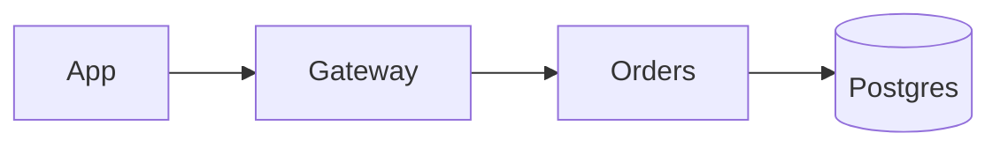

<DataTable caption="Largest countries">
```json
[{"Country":"Russia","Area (km²)":17098246},{"Country":"Canada","Area (km²)":9984670},{"Country":"China","Area (km²)":9596961}]
```
</DataTable>

<Diagram title="Order flow">

</Diagram>
